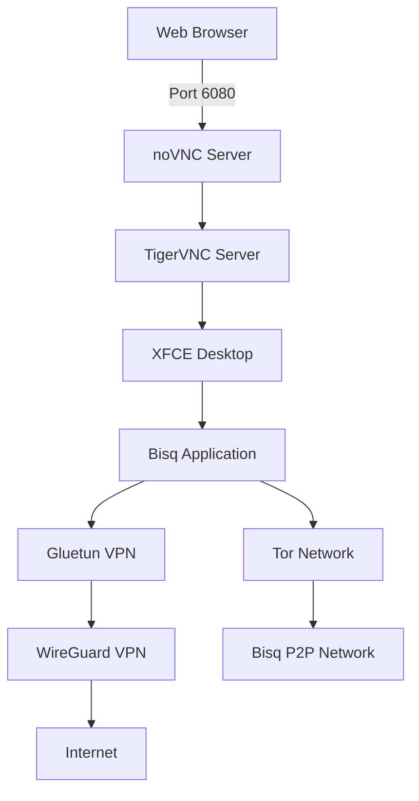

# Bisq VPN Container

> A secure, containerized solution for running Bisq through a VPN with browser-based access

[](https://www.docker.com/)
[](https://bisq.network/)
[](https://www.wireguard.com/)
[](LICENSE)

## 🎯 Overview

This project provides a production-ready Docker solution for running [Bisq](https://bisq.network/) (decentralized Bitcoin exchange) through a VPN connection. It combines security, privacy, and convenience by routing all Bisq traffic through WireGuard VPN while providing browser-based access via noVNC.

### Why Use This?

- **Enhanced Privacy**: All Bisq traffic routed through VPN with automatic kill switch
- **Browser Access**: No need for local Bisq installation - access from any modern browser
- **Security First**: Isolated container environment with VPN-only network access
- **Convenience**: Automatic updates, persistent data, and easy management scripts
- **Platform Agnostic**: Run Bisq on any system that supports Docker

## ✨ Features

### Core Functionality
- 🔒 **WireGuard VPN Integration** - Fast, modern VPN protocol with kill switch protection
- 🌐 **Web-Based Access** - Full Bisq GUI through noVNC (no client installation required)
- 🔄 **Automatic Window Resizing** - Bisq window dynamically adjusts to browser size
- 📋 **Clipboard Synchronization** - Seamless copy/paste between host and container
- 💾 **Persistent Data Storage** - Wallet and settings preserved across restarts
- 🚀 **One-Click Updates** - Automated Bisq version management
- 🧅 **Tor Integration** - Full P2P connectivity through Tor network

### Technical Features
- **DNS over TLS** - Encrypted DNS queries via Cloudflare
- **Process Supervision** - Automatic restart of failed services
- **Health Monitoring** - Built-in health checks for all components
- **Optimized Desktop** - Minimal XFCE environment without distractions
- **Multi-Architecture** - Supports AMD64 and ARM64 platforms

## 📋 Prerequisites

### System Requirements
- **Docker**: Version 20.10 or higher
- **Docker Compose**: Version 2.0 or higher
- **RAM**: Minimum 4GB (8GB recommended)
- **Storage**: 10GB free space minimum
- **Network**: Stable internet connection

### VPN Requirements
- Active VPN subscription supporting WireGuard
- WireGuard configuration file from your provider
- VPN endpoint that allows P2P/Tor traffic

## 🚀 Quick Start

### 1. Clone the Repository
```bash
git clone https://github.com/yourusername/bisq-vpn-container.git
cd bisq-vpn-container
```

### 2. Configure VPN
Copy the WireGuard template and add your VPN settings:
```bash
# Copy the template
cp docker/gluetun/config/wireguard.conf.example docker/gluetun/config/wireguard.conf

# Edit with your VPN provider's settings
nano docker/gluetun/config/wireguard.conf
```

**Important**: Replace all `YOUR_*` placeholders with actual values from your VPN provider.

### 3. Extract VPN Settings
Extract the required values from your WireGuard config and update `docker-compose.yml`:
```yaml
environment:
  - WIREGUARD_PRIVATE_KEY=your_private_key_here
  - WIREGUARD_ADDRESSES=your_address_here
  - WIREGUARD_PUBLIC_KEY=server_public_key_here
  - WIREGUARD_ENDPOINT_IP=server_ip_here
  - WIREGUARD_ENDPOINT_PORT=server_port_here
```

**Important**: 
- Use IP address for `WIREGUARD_ENDPOINT_IP`, not hostname
- Remove any IPv6 addresses from `WIREGUARD_ADDRESSES`

### 4. Start the Containers
```bash
docker compose up -d
```

### 5. Access Bisq
Open your browser and navigate to:
```
http://localhost:6080
```
- **Password**: `bisqvnc` (default)

## 📖 Detailed Setup

### Configuration Options

#### Environment Variables (.env file)
```bash
# VNC Configuration
VNC_PASSWORD=bisqvnc
VNC_RESOLUTION=1280x720

# Bisq Configuration
BISQ_NETWORK=BTC_MAINNET  # or BTC_TESTNET

# Timezone
TZ=UTC
```

#### Advanced VPN Settings
The Gluetun container supports extensive VPN configuration:

```yaml
environment:
  # DNS Configuration
  - DOT=on                        # DNS over TLS
  - DOT_PROVIDERS=cloudflare      # DNS provider
  - BLOCK_MALICIOUS=on            # Block malicious domains
  - BLOCK_ADS=off                 # Ad blocking (optional)
  
  # Security
  - KILL_SWITCH=on                # Block all traffic if VPN drops
  - FIREWALL_INPUT_PORTS=6080,5901  # Allow VNC access
```

### Building from Source

If you need to customize the Bisq container:

```bash
# Build with custom modifications
docker compose build --no-cache bisq

# Build with specific Bisq version
sed -i 's/ENV BISQ_VERSION=.*/ENV BISQ_VERSION=1.9.22/' docker/bisq/Dockerfile
docker compose build bisq
```

## 💻 Usage

### Management Commands

The project includes a comprehensive management script:

```bash
# Start all services
./scripts/start-bisq-vpn.sh start

# Check status
./scripts/start-bisq-vpn.sh status

# View logs
./scripts/start-bisq-vpn.sh logs

# Test VPN connection
./scripts/start-bisq-vpn.sh test

# Stop all services
./scripts/start-bisq-vpn.sh stop

# Rebuild containers
./scripts/start-bisq-vpn.sh build

# Clean everything (including data)
./scripts/start-bisq-vpn.sh clean
```

### Updating Bisq

Use the automated update script:

```bash
./scripts/update-bisq.sh
```

This script will:
1. Check for the latest Bisq version
2. Backup your current data
3. Update and rebuild the container
4. Restart with the new version

### Manual Operations

```bash
# Check VPN IP address
docker exec gluetun wget -qO- https://ipinfo.io/ip

# Access Bisq container shell
docker exec -it bisq bash

# Check Bisq logs
docker exec bisq cat /var/log/supervisor/bisq.log

# Manually trigger window resize
docker exec bisq bash -c 'DISPLAY=:1 wmctrl -r "Bisq" -b add,fullscreen'
```

## 🏗️ Architecture

### Container Structure



### Network Flow

1. **Bisq Container** uses Gluetun's network stack (`network_mode: "service:gluetun"`)
2. **All traffic** from Bisq routes through the VPN tunnel
3. **Kill switch** prevents any traffic leaks if VPN disconnects
4. **Tor traffic** for Bisq P2P connectivity is allowed through the VPN

### Process Management

Supervisord manages all processes with proper startup order:

```
1. VNC Server (Xtigervnc)
   ↓
2. Desktop Environment (XFCE)
   ↓
3. Clipboard Tools (vncconfig, autocutsel)
   ↓
4. Web Server (noVNC)
   ↓
5. Bisq Application
   ↓
6. Resize Monitor (auto-resize daemon)
```

## 📁 Project Structure

```
bisq-vpn-container/
├── config/
│   └── wireguard.conf          # VPN configuration (user-provided)
├── scripts/
│   ├── start-bisq-vpn.sh       # Main management script
│   ├── test-vpn.sh             # VPN connection tester
│   └── update-bisq.sh          # Bisq version updater
├── volumes/                    # Persistent data (auto-created)
│   ├── bisq-data/              # Wallet, trades, Tor hidden service
│   ├── bisq-config/            # Application settings
│   └── gluetun/                # VPN state cache
├── docker-compose.yml          # Container orchestration
├── docker/                     # Docker-related files
│   └── bisq/                   # Bisq container files
│       ├── Dockerfile          # Bisq container definition
│       └── config/             # Container configurations
│           ├── supervisord.conf    # Process manager configuration
│           ├── monitor-resize.sh   # Window resize daemon
│           └── novnc-index.html    # Custom noVNC interface
└── README.md                   # This file
```

## 🔒 Security Considerations

### Data Protection
- **Wallet Backup**: Always backup `volumes/bisq-data/` - it contains your wallet and funds
- **VPN Kill Switch**: Enabled by default to prevent IP leaks
- **Container Isolation**: Bisq runs in an isolated environment
- **No Root Access**: Bisq runs as non-root user inside container

### Network Security
- **VPN-Only Access**: Bisq cannot access internet without VPN
- **DNS over TLS**: Encrypted DNS queries prevent DNS leaks
- **Tor Integration**: P2P traffic uses Tor for additional privacy
- **Firewall Rules**: Strict firewall configuration in Gluetun

### Best Practices
1. **Regular Backups**: Backup the `volumes/` directory regularly
2. **Secure VNC Password**: Change default password in production
3. **Local Access Only**: Don't expose ports 6080/5901 to internet
4. **Update Regularly**: Keep Bisq and containers updated

## 🛠️ Troubleshooting

### VPN Connection Issues

**Problem**: VPN not connecting
```bash
# Check Gluetun logs
docker logs gluetun

# Verify endpoint is reachable
docker exec gluetun ping -c 3 <endpoint_ip>

# Check DNS resolution
docker exec gluetun nslookup google.com
```

**Solution**: 
- Verify WireGuard configuration is correct
- Ensure endpoint IP (not hostname) is used
- Check if your VPN subscription is active

### Bisq Access Issues

**Problem**: Cannot access web interface
```bash
# Check if containers are running
docker ps

# Verify ports are not in use
sudo netstat -tulpn | grep -E '6080|5901'

# Check noVNC logs
docker logs bisq
```

**Solution**:
- Ensure no other service is using ports 6080/5901
- Wait 30-60 seconds for services to fully start
- Try accessing via VNC client on port 5901

### Display Issues

**Problem**: Bisq window not resizing with browser
```bash
# Check resize monitor is running
docker exec bisq ps aux | grep monitor-resize

# View resize monitor logs
docker exec bisq cat /var/log/supervisor/resize-monitor.log

# Manually trigger fullscreen
docker exec bisq bash -c 'DISPLAY=:1 wmctrl -r "Bisq" -b add,fullscreen'
```

### Clipboard Not Working

**Problem**: Cannot copy/paste between host and container
```bash
# Check clipboard tools
docker exec bisq ps aux | grep -E "vncconfig|autocutsel"

# Restart clipboard services
docker exec bisq bash -c 'DISPLAY=:1 vncconfig -nowin &'
docker exec bisq bash -c 'DISPLAY=:1 autocutsel -fork'
```

## 🚧 Advanced Configuration

### Custom Bisq Arguments

Modify `start-bisq.sh` in the Dockerfile to add Bisq arguments:
```bash
/opt/bisq/bin/Bisq \
  --baseCurrencyNetwork=BTC_MAINNET \
  --daoActivated=true \
  --maxConnections=12
```

### Multiple VPN Providers

To use different VPN providers, modify the Gluetun environment:
```yaml
environment:
  - VPN_SERVICE_PROVIDER=mullvad  # or nordvpn, expressvpn, etc.
  - VPN_TYPE=wireguard
  # Provider-specific settings...
```

### Resource Limits

Add resource constraints in `docker-compose.yml`:
```yaml
services:
  bisq:
    deploy:
      resources:
        limits:
          cpus: '2.0'
          memory: 4G
        reservations:
          memory: 2G
```

## 📊 Performance Optimization

### Recommended Settings

For optimal performance:
```yaml
# docker-compose.yml
environment:
  - VNC_RESOLUTION=1920x1080     # Higher resolution
  - BISQ_MAX_MEMORY=2048m        # More memory for Bisq
  - WIREGUARD_MTU=1420           # Optimal MTU for WireGuard
```

### Monitoring

Monitor resource usage:
```bash
# Container stats
docker stats bisq gluetun

# VPN performance
docker exec gluetun curl -s https://fast.com

# Bisq memory usage
docker exec bisq ps aux | grep java
```

## 🤝 Contributing

Contributions are welcome! Please feel free to submit a Pull Request.

### Development Setup
1. Fork the repository
2. Create your feature branch (`git checkout -b feature/AmazingFeature`)
3. Commit your changes (`git commit -m 'Add some AmazingFeature'`)
4. Push to the branch (`git push origin feature/AmazingFeature`)
5. Open a Pull Request

### Testing Changes
```bash
# Test build
docker compose build --no-cache bisq

# Run tests
./scripts/test-vpn.sh

# Validate functionality
docker compose up -d
curl http://localhost:6080
```

## 📄 License

This project is licensed under the MIT License - see the [LICENSE](LICENSE) file for details.

## 🙏 Acknowledgments

- [Bisq](https://bisq.network/) - The decentralized Bitcoin exchange
- [Gluetun](https://github.com/qdm12/gluetun) - VPN client in Docker
- [TigerVNC](https://tigervnc.org/) - High-performance VNC implementation
- [noVNC](https://novnc.com/) - HTML5 VNC client

## 📞 Support

- **Issues**: [GitHub Issues](https://github.com/yourusername/bisq-vpn-container/issues)
- **Discussions**: [GitHub Discussions](https://github.com/yourusername/bisq-vpn-container/discussions)
- **Bisq Support**: [Bisq Documentation](https://bisq.wiki/)

## ⚠️ Disclaimer

This software is provided "as is" without warranty of any kind. Always backup your Bisq data before making changes. The authors are not responsible for any loss of funds or data.

---

<p align="center">Made with ❤️ for the Bisq community</p>